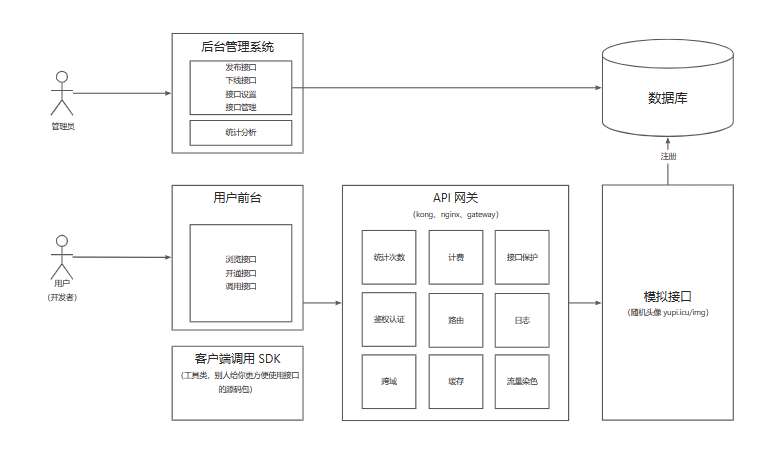
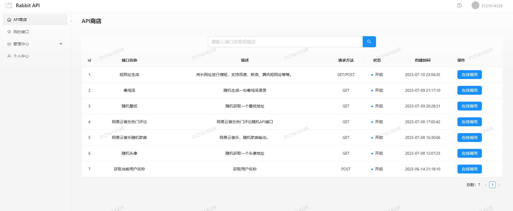
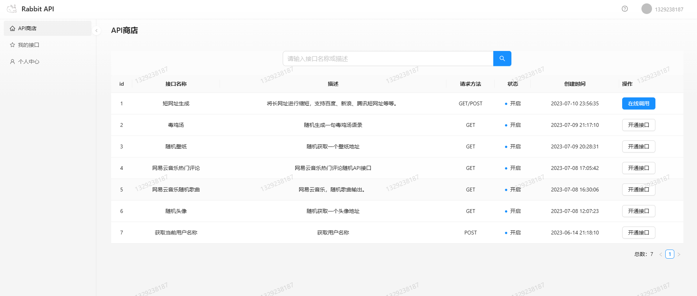

# Cai-API 接口开放平台


## 项目简介
- 一个提供 API 接口供开发者调用的平台。
管理员可以接入并发布接口，统计分析各接口调用情况；用户可以注册登录并开通接口调用权限，
然后可以浏览接口及在线调试，还能使用客户端 SDK 轻松在代码中调用接口。
### 业务流程



### 技术选型

- Spring Boot
- Spring Boot Starter(SDK开发)
- Dubbo（RPC）
- nacos
- Spring Cloud Gateway(网关 限流 日志实现)

### 快速上手

- 打开项目的配置文件，将mysql,redis等ip及其密码设置为自己的
```yml
  datasource:
    driver-class-name: com.mysql.cj.jdbc.Driver
    url: jdbc:mysql://localhost:3306/caiapi
    username: root
    password: root
```
- 导入sql文件
- 将common,sdk模块打包至本地（引用）
```text
运用maven的package指令
```
- 运行admin,interface,gateway模块
```text
运行三个模块的启动类
```
- 启动前端

### 项目截图
- 管理员功能界面，具有下线，发布，开通，调试等功能。

- 普通用户功能节目。

## 项目声明

- 本项目基于[@程序员鱼皮](https://yupi.icu/)的API项目开发，并参考了多位鱼友的开发经验进行二次重构，此项目仅用于学习与交流，不另做他用。
